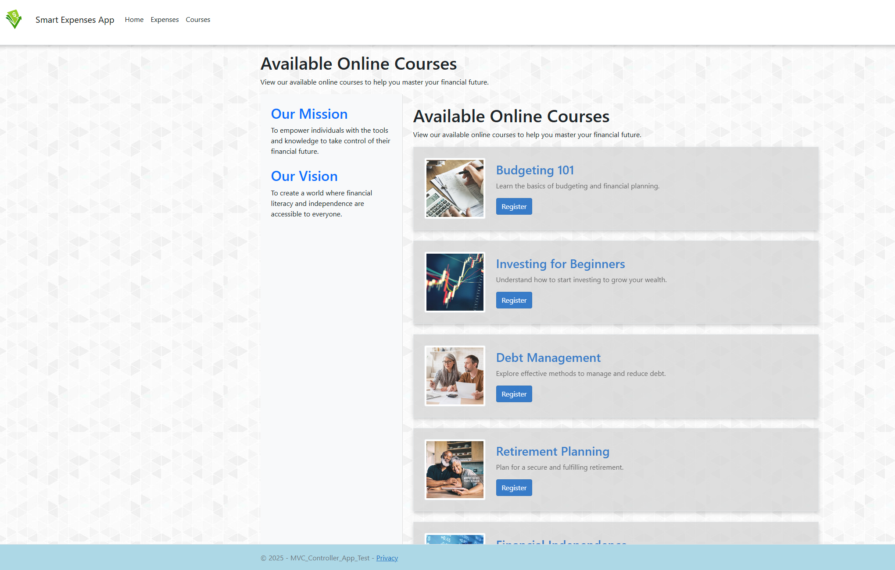
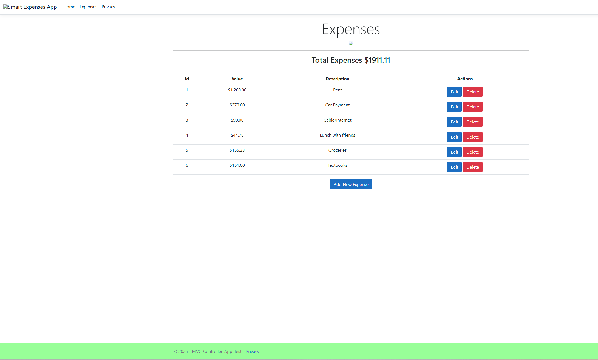

### Smart-Expenses-App
Smart Expenses App is a financial literacy site that lets the user track expenses with live updating. The site also offers a list of courses for the user to register for to help strengthen their financial future. Smart Expenses App was developed on Micrsoft Visual Studio using C# and ASP.NET MVC applications.

This page shows Smart Expenses App's expense tracker. This page uses fundamental CRUD operations to create new expenses and edit or delete existing ones. 

